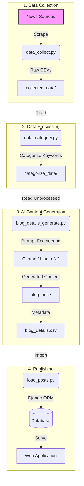

# Automated Tech News Aggregator & Blog Platform

## Project Overview
This project is an end-to-end automated pipeline that scrapes the latest technology news from major global sources, uses local AI to summarize and categorize the content, and automatically publishes unique blog posts to a Django-based web application.

## 🚀 Workflow Architecture

## 🛠️ Technical Workflow Steps

### 1. Data Collection (`data_collect.py`)
*   **Sources**: Automatically scrapes top tech news sites including **CNN, TechCrunch, Wired, The Verge, CNET, and TechRadar**.
*   **Technology**: Uses the `newspaper3k` library for article extraction and parsing.
*   **Logic**: 
    *   Validates article dates (filters out articles older than 7 days).
    *   Prevents duplicates using URL checking.
    *   Saves raw data (Title, URL, Summary, Authors) to CSV files.

### 2. Intelligent Categorization (`data_category.py`)
*   **Process**: Analyzes the raw article summaries to assign a relevant category.
*   **Logic**: Uses keyword matching algorithms to classify articles into:
    *   *AI, Computer, Mobile, Tech Gadgets, or Other*.
*   **Deduplication**: Ensures only new, unseen articles are processed for the next stage.

### 3. AI-Powered Content Generation (`blog_details_generate.py`)
*   **AI Engine**: Integrates with **Ollama** running **Llama 3.2 (1b)** locally.
*   **Prompt Engineering**: Uses custom prompts to rewrite technical news into engaging, SEO-friendly blog descriptions.
*   **Output**: 
    *   Generates a unique `post_id` (UUID) for every article.
    *   Saves the full blog content to text files.
    *   Updates a master `blog_details.csv` registry.

### 4. Automated Publishing (`load_posts.py`)
*   **Integration**: Connects directly to the **Django** backend.
*   **Model Management**: checks for existing `post_id`s to ensure idempotency (updates existing or creates new).
*   **Deployment**: Instantly makes the new content live on the web platform.

## 💻 Tech Stack
*   **Language**: Python 3.x
*   **Web Framework**: Django
*   **AI/LLM**: Ollama, Llama 3.2
*   **Scraping**: Newspaper3k, Requests
*   **Data Handling**: Pandas, CSV
